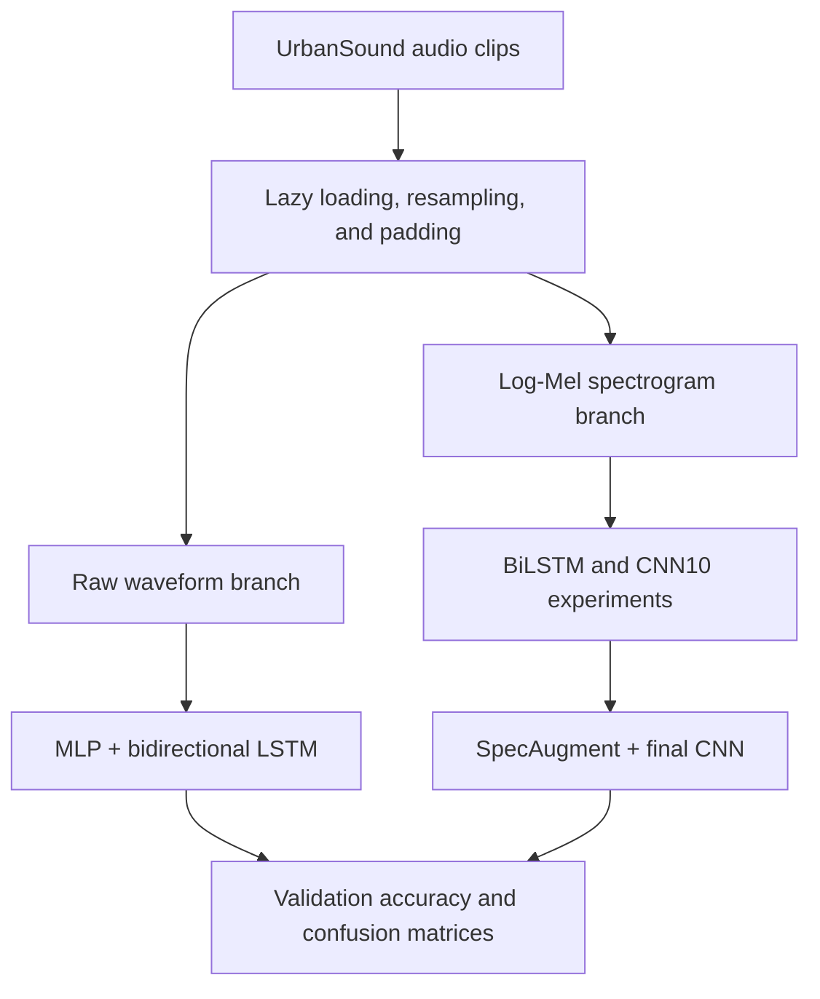

# UrbanSound Audio Classification

[](https://www.python.org/)
[](https://pytorch.org/)
[](https://jupyter.org/)

An end-to-end deep learning project for classifying environmental sounds from the **UrbanSound8K** dataset. The project compares raw-waveform and time-frequency representations, progresses from recurrent baselines to a convolutional architecture, and evaluates SpecAugment as a regularization strategy.

The strongest configuration—a CNN trained on augmented log-Mel spectrograms—achieved **92.73% validation accuracy** across 10 urban sound classes.

> The reported scores come from the notebook's validation split and should not be interpreted as performance on the official UrbanSound8K test folds.

## Project Objective

Environmental audio is difficult to classify directly because recordings vary in duration, loudness, background noise, and temporal structure. This project investigates three practical questions:

1. How effective is a recurrent model when trained directly on raw waveforms?
2. How much does a log-Mel representation improve acoustic classification?
3. Can a CNN with spectrogram augmentation provide a more accurate and robust solution?

## Dataset

[UrbanSound8K](https://urbansounddataset.weebly.com/urbansound8k.html) contains **8,732 labeled audio clips** from 10 urban sound categories. The prepared split used in this notebook contains **4,500 training clips** and **935 validation clips**.

| Class | Class | Class |
|---|---|---|
| Air conditioner | Car horn | Children playing |
| Dog bark | Drilling | Engine idling |
| Gun shot | Jackhammer | Siren |
| Street music |  |  |

The notebook downloads and extracts the prepared dataset automatically. An internet connection is therefore required for the data-loading step.

## Workflow



## Methodology

### 1. Audio preprocessing

- Audio is loaded lazily to avoid keeping the entire dataset in memory.
- Recordings are resampled to **44.1 kHz**.
- Each waveform is padded to a fixed length of **384,000 samples**.
- Labels are mapped to the 10 UrbanSound8K categories.

### 2. Raw-waveform baseline

The first model operates directly on waveform windows. Each 1,024-sample window is projected through a multilayer perceptron before a two-layer bidirectional LSTM performs sequence classification. This experiment establishes how difficult it is to learn useful acoustic structure from minimally processed audio.

### 3. Log-Mel feature extraction

The project implements the log-Mel transformation explicitly:

- Hann-windowed short-time Fourier transform
- Power spectrum computation
- Projection onto 64 Mel-frequency bands
- Logarithmic amplitude compression

The custom implementation is checked against the corresponding `torchaudio` transformation with a numerical tolerance of `1e-5`.

### 4. Spectrogram-based models

Two architectures are evaluated on log-Mel features:

- **Bidirectional LSTM:** models the spectrogram as a temporal sequence.
- **CNN10:** a convolutional network inspired by [PANNs](https://arxiv.org/abs/1912.10211), designed to learn local time-frequency patterns.

### 5. SpecAugment

The final experiment applies random time and frequency masking to log-Mel spectrograms during training. This encourages the CNN to rely on distributed acoustic evidence rather than a small number of dominant regions.

## Results

| Model | Input representation | Validation accuracy |
|---|---|---:|
| BiLSTM baseline | Raw waveform | 11.76% |
| BiLSTM | Log-Mel spectrogram | 82.67% |
| CNN10 | Log-Mel spectrogram | 85.13% |
| **CNN10 + SpecAugment** | **Augmented log-Mel spectrogram** | **92.73%** |

Moving from raw audio to log-Mel features improved validation accuracy by **70.91 percentage points**. Replacing the spectrogram BiLSTM with CNN10 added another **2.46 points**, while SpecAugment delivered a further **7.60-point gain**.

## Error Analysis

- The raw-waveform model largely collapses toward a few frequent or acoustically broad classes, especially `children_playing` and `street_music`.
- The log-Mel BiLSTM performs particularly well on `engine_idling`, `jackhammer`, and `gun_shot`, but reaches only about **55% recall** for `street_music`.
- The unaugmented CNN still confuses `street_music` with `children_playing` and achieves about **69% recall** for `car_horn`.
- SpecAugment improves the balance across classes: the final model reaches approximately **84–99% recall** per class, including **90%** for `street_music` and **94%** for `car_horn`.

These results suggest that the time-frequency representation is the largest source of improvement, while augmentation is especially valuable for reducing class-specific weaknesses.

## Recommended Model

The **log-Mel CNN10 with SpecAugment** is the preferred configuration. It provides the highest validation accuracy, the most balanced confusion matrix, and a comparatively direct inference pipeline:

`waveform → resampling/padding → log-Mel spectrogram → CNN → class probabilities`

## Getting Started

### Requirements

- Python 3.10 or newer
- Jupyter Notebook or JupyterLab
- A CUDA-enabled GPU is recommended for training

Create and activate a virtual environment:

```bash
python -m venv .venv
source .venv/bin/activate
```

On Windows:

```powershell
.venv\Scripts\activate
```

Install the main dependencies:

```bash
pip install jupyter matplotlib numpy pandas requests scikit-learn seaborn torch torchaudio
```

Launch Jupyter and open the notebook:

```bash
jupyter notebook UrbanSound_Audio_Classification.ipynb
```

Run the cells from top to bottom. The notebook downloads the prepared archive, extracts the audio data, trains each model, and produces learning curves and confusion matrices.

## Repository Structure

```text
.
├── UrbanSound_Audio_Classification.ipynb  # Complete experiment
├── README.md                               # Project documentation
└── data/                                   # Generated after data download
```

## Limitations and Next Steps

- Evaluate with the official UrbanSound8K fold protocol and a fully held-out test set.
- Report macro-F1, per-class precision and recall, and confidence intervals in addition to accuracy.
- Add fixed random seeds, early stopping, checkpointing, and experiment tracking.
- Make the data pipeline configurable for device, batch size, sample rate, and clip length.
- Compare the custom models with pretrained audio encoders such as PANNs, AST, or wav2vec 2.0.
- Package the best model behind a small inference API or interactive demo.

## Technology Stack

`Python` · `PyTorch` · `torchaudio` · `NumPy` · `pandas` · `scikit-learn` · `Matplotlib` · `Seaborn` · `Jupyter`

## Author

**Muhammad Murodzoda**

